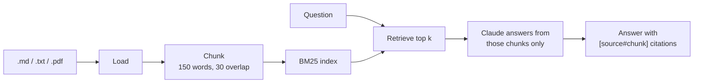

# doc-qa-agent

[](https://github.com/bvgitty/doc-qa-agent/actions/workflows/ci.yml)

Ask questions about your own documents from the command line. A small retrieval-augmented generation (RAG) assistant: it finds the most relevant passages in your Markdown, text and PDF files with BM25 search, then asks Claude to answer **using only those passages**, with citations.

```
> python -m rag_agent --docs ..\dev-notes --show-sources "how do I keep a fork in sync?"
Loaded 26 documents as 83 chunks.

  [day06-forks.md#0] score=13.98
  ...

There are two ways to keep a fork in sync [day06-forks.md#0]: ...
```

## How it works



| Module | Job |
| --- | --- |
| `rag_agent/loader.py` | Reads `.md`, `.txt` and `.pdf` files |
| `rag_agent/chunker.py` | Splits text into overlapping word chunks |
| `rag_agent/retriever.py` | BM25 keyword ranking, written in plain Python |
| `rag_agent/generator.py` | Builds the prompt and calls the Claude API |
| `rag_agent/__main__.py` | Command-line interface |

**Why BM25 instead of embeddings?** No second API, nothing heavy to install, and every score can be explained. Embeddings are the planned next step (see Roadmap).

## Setup

```powershell
git clone https://github.com/bvgitty/doc-qa-agent.git
cd doc-qa-agent
python -m venv .venv
.\.venv\Scripts\Activate.ps1        # macOS/Linux: source .venv/bin/activate
python -m pip install -r requirements.txt
```

Copy `.env.example` to `.env` and put your [Claude API key](https://console.anthropic.com/) in it. `.env` is ignored by Git; never commit a key.

## Usage

```powershell
python -m rag_agent "when is git reset safe?"                 # one question, uses ./docs
python -m rag_agent --docs path\to\notes "your question"      # your own folder
python -m rag_agent --docs path\to\notes                      # chat mode (type quit to leave)
```

| Option | Meaning | Default |
| --- | --- | --- |
| `--docs` | Folder of documents (searched recursively) | `docs` |
| `-k` | Number of chunks to retrieve | `4` |
| `--show-sources` | Print the retrieved chunks and their scores | off |
| `RAG_MODEL` (in `.env`) | Claude model to use | `claude-haiku-4-5-20251001` |

## Tests

```powershell
python -m pip install -r requirements-dev.txt
python -m pytest -v
```

11 tests, no API key or network needed: the Claude call is tested with a fake client. CI runs them on Python 3.12, 3.13 and 3.14.

## What I learned evaluating it

I asked my own study notes *"how do I keep a fork in sync?"*:

| | Top retrieved chunk | Answer |
| --- | --- | --- |
| First try | A chunk about undo tools; filler words (*how, do, I, a, in*) outranked the topic | "I don't know": the notes never described syncing |
| After adding the sync steps to my notes | `day06-forks.md#0` (score 5.83 → 13.98) | Correct steps, each cited |

Three lessons: **document quality comes first** (no code changed between the two runs), **retrieval comes second** (keyword search is fooled by filler words and exact spelling, tracked in [#4](https://github.com/bvgitty/doc-qa-agent/issues/4)), and **citations matter** (one early answer over-read a note; the citation made it easy to check).

## Roadmap

- Stop words and simple stemming ([#4](https://github.com/bvgitty/doc-qa-agent/issues/4))
- Embedding-based retrieval, then hybrid search
- Save the index to disk for large document sets

## License

MIT# doc-qa-agent
Ask questions about your documents: a small RAG assistant using BM25 retrieval and Claude
